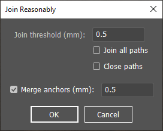

# Scripts for Adobe Illustrator

Helpful Adobe Illustrator scripts originally authored by [Hiroyuki Sato](http://shspage.com/).

Descriptions and additional scripts from the original author can be found at http://shspage.com/aijs/en/

## General usage

For one-time use,

1. Save the appropriate script file anywhere on the computer
2. In Illustrator, select the menu item File > Scripts > Browse
3. Locate the script and open to run it immediately

To install for repeated use,

1. Save the appropriate script file to <code><var>illustrator_install_dir</var>/Presets/<var>locale</var>/Scripts</code>
2. If Illustrator is running, restart it
3. Select the menu item File > Scripts > <var>script_name</var> to run it immediately

Refer to [Illustrator Help online](https://helpx.adobe.com/uk/illustrator/desktop/automate-visualize-data/automate-actions/install-and-run-scripts.html) for more information.

## Descriptions

### Join Reasonably.jsx

Improved version of Illustrator's path **Join** tool (Object > Path > Join, or Ctrl+J)

This script provides the ability to select a large set of paths and only join the ones that are close to each other, unlike the built-in tool which joins all selected paths indiscriminately.

In addition, there is the option to close all paths after joining, and to merge anchors that are close to each other.

#### Differences from original

In the [original script](http://shspage.com/aijs/en/#join_reasonably), the "Close paths" only worked when the "Join all paths" option was also set, whereas in the current script they can be used together.

In the original script, unsetting the "Close paths" option forced all resulting paths to be open, whereas in the current script any endpoints that are less than "Join threshold" apart (as long as it is set) can be joined, which may produce closed paths even without the "Close paths" setting.

<table>
	<tr>
		<th>Setting</th>
		<th>Current script</th>
		<th>Original script</th>
	</tr>
	<tr>
		<td>
			Join threshold: <i>disabled</i> 
			Join all paths: 🗹 
			Close paths: 🗹
		</td>
		<td>Single closed path</td>
		<td>Single closed path</td>
	</tr>
	<tr>
		<td>
			Join threshold: <i>set</i> 
			Join all paths: ☐ 
			Close paths: 🗹
		</td>
		<td>One or more paths, all <mark>closed</mark></td>
		<td>One or more paths, all <mark>open</mark>; "Close paths" ignored</td>
	</tr>
	<tr>
		<td>
			Join threshold: <i>disabled</i> 
			Join all paths: 🗹 
			Close paths: ☐
		</td>
		<td>Single open path</td>
		<td>Single open path</td>
	</tr>
	<tr>
		<td>
			Join threshold: <i>set</i> 
			Join all paths: ☐ 
			Close paths: ☐
		</td>
		<td>One or more paths, <mark>may be closed</mark> if path joined to itself</td>
		<td>One or more paths, <mark>all open</mark>; never joined to itself even when within threshold</td>
	</tr>
</table>

The original script provides additional configurable settings, `conf.hanLen` and `conf.dontAddRevHan`. These are still present but can only be configured by modifying the script file itself. More information on these settings can be found in the [original description](http://shspage.com/aijs/en/#join_reasonably).

## License

Modified work copyright © 2026 Yu Shiyang

Original work copyright © 2013 Hiroyuki Sato, All Rights Reserved.
These scripts are distributed under the MIT License.
Free to use and distribute.
See the LICENSE.txt included in the archive for details.

## Contact

For the original author, 
Email form via http://shspage.com/aijs/en/ 
Twitter: [@shspage_en] (English) / [@shspage] (Japanese)

[@shspage_en]:http://twitter.com/shspage_en
[@shspage]:http://twitter.com/shspage
